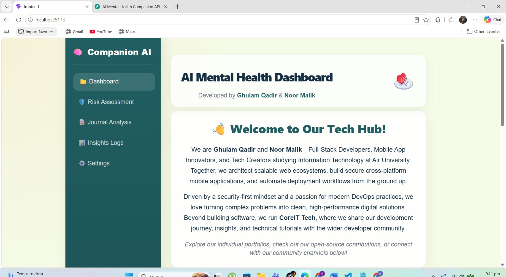
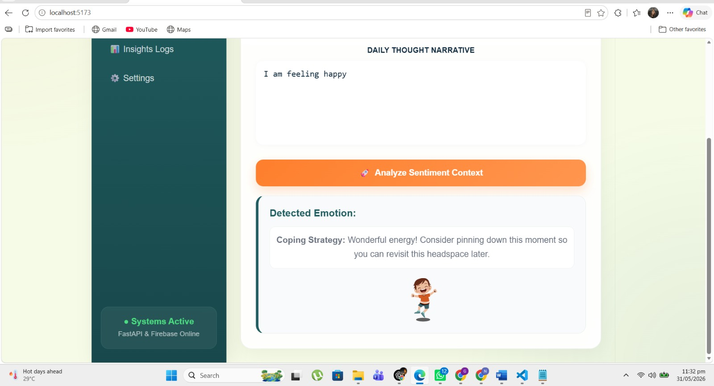
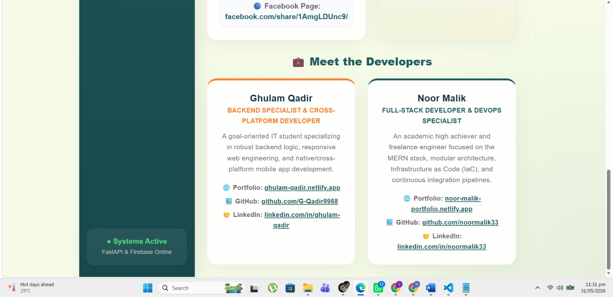
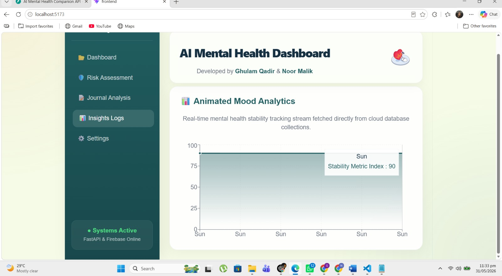
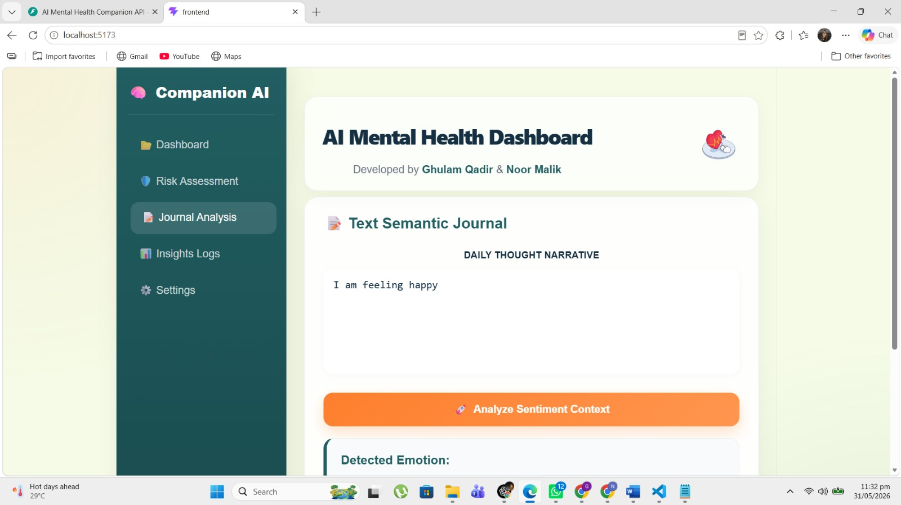
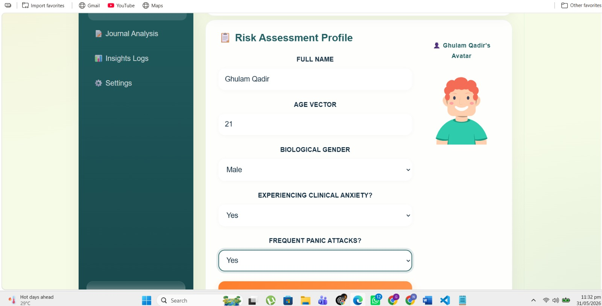
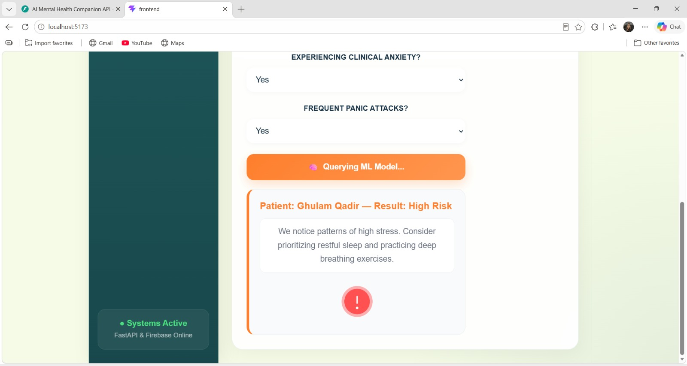
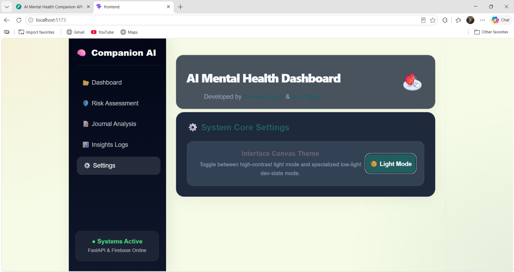
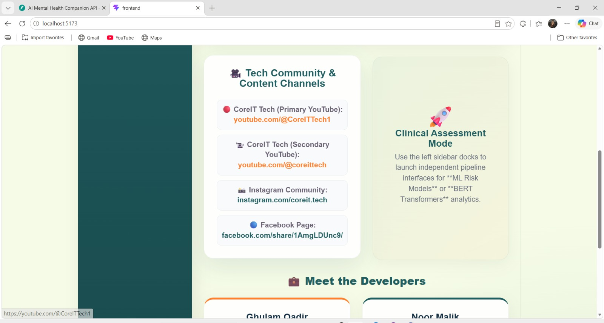

# 🧠 AI Mental Health Companion System

<div align="center">



### 🚀 AI-Powered Mental Health Analysis & Emotion Detection Platform

A professional AI-driven mental health companion system designed to analyze emotions, assess mental health risks, generate intelligent insights, and provide interactive analytics using NLP, Machine Learning, FastAPI, and React.

---

### 👨‍💻 Developed By

**Noor Malik** & **Ghulam Qadir**

</div>

---

# 📌 Project Description

The **AI Mental Health Companion System** is a modern AI-powered web application developed to assist in emotional and mental health analysis using Machine Learning and Natural Language Processing (NLP).

The system performs:

* 🧠 Emotion Detection using NLP
* 📊 Mental Health Risk Assessment
* 📈 AI Insights & Analytics
* 📝 Journal Analysis
* 🤖 AI Prediction Models
* 🔍 Sentiment & Emotion Classification
* 📚 Interactive Dashboard
* 🔐 Backend APIs with FastAPI
* ⚡ Responsive Frontend using React + Vite

This project combines:

* **Frontend:** React.js + Vite
* **Backend:** FastAPI
* **Machine Learning:** Scikit-learn
* **NLP Models:** Transformers / BERT / RoBERTa
* **Database:** MongoDB
* **Visualization:** Matplotlib, Seaborn
* **Model Training:** Python

---

# ✨ Key Features

## 🧠 AI Features

* Emotion Detection using NLP
* Student Mental Health Prediction
* Sentiment Analysis
* Risk Assessment Engine
* AI Insight Generation
* Journal Emotion Tracking

## 💻 Frontend Features

* Modern Responsive UI
* Dashboard Analytics
* Animated Sections
* Fast React + Vite Architecture
* Interactive User Experience

## ⚙️ Backend Features

* REST APIs using FastAPI
* ML Model Integration
* Real-Time Prediction Endpoints
* JSON-Based Communication
* API Documentation via Swagger

---

# 🛠️ Technologies Used

| Technology           | Purpose             |
| -------------------- | ------------------- |
| React.js             | Frontend UI         |
| Vite                 | Frontend Build Tool |
| FastAPI              | Backend APIs        |
| Python               | AI & Backend Logic  |
| Scikit-learn         | Machine Learning    |
| Transformers         | NLP Models          |
| PyTorch              | Deep Learning       |
| MongoDB              | Database            |
| Pandas & NumPy       | Data Processing     |
| Matplotlib & Seaborn | Visualization       |

---

# 📂 Project Structure

```bash
ai-mental-health-companion/
├── backend/
│   ├── .ipynb_checkpoints/
│   ├── __pycache__/
│   ├── dataset/
│   │   ├── Emotions dataset for NLP/
│   │   │   ├── test.txt
│   │   │   ├── train.txt
│   │   │   └── val.txt
│   │   └── Student Mental health/
│   │       └── Student Mental health.csv
│   ├── models/
│   ├── venv/
│   ├── .gitkeep
│   ├── emotion_nlp_model.pkl
│   ├── emotion_vectorizer.pkl
│   ├── main.py
│   ├── train_emotion_nlp.py
│   └── train_predictor.py
│
├── demo/
│   ├── .gitkeep
│   ├── dashboard.jpeg
│   ├── detected_emotions.jpeg
│   ├── developers_info.jpeg
│   ├── insights_logs.jpeg
│   ├── journal_analysis.jpeg
│   ├── risk_assessment_profile_1.jpeg
│   ├── risk_assessment_profile_2.jpeg
│   ├── settings.jpeg
│   ├── tech_community_and_content_channels.jpeg
│   ├── video demo link.txt
│   └── Video Project 1.mp4
│
├── frontend/
│   ├── node_modules/
│   ├── public/
│   ├── src/
│   ├── .gitignore
│   ├── eslint.config.js
│   ├── index.html
│   ├── package-lock.json
│   ├── package.json
│   ├── README.md
│   └── vite.config.js
│
├── notebooks/
│   ├── .ipynb_checkpoints/
│   ├── .gitkeep
│   ├── Journal_Text_Analysis.ipynb
│   └── Student_Mental_Health_Analysis.ipynb
│
├── report/
│   ├── .gitkeep
│   ├── AI Mental Health report.docx
│   └── AI Mental Health report.pdf
│
├── .gitattributes
├── .gitignore
├── LICENSE
├── package-lock.json
└── README.md
```

---

# ⚙️ Complete Setup Guide

# 🔹 Frontend Setup (React + Vite)

## 1️⃣ React Installation Commands

```bash
npx create-react-app .
npm create react-app@latest . -- --force
```

---

## 2️⃣ Run React App

```bash
npm install
npm start
```

---

## 3️⃣ If npm install fails → Setup using Vite

```bash
Remove-Item -Recurse -Force *
npm create vite@latest . -- --template react
```

---

## 4️⃣ Manual Vite Dependency Installation

```bash
Remove-Item package-lock.json

npm init -y

npm install react react-dom

npm install -D vite @vitejs/plugin-react eslint
```

---

# 🔹 Backend Setup (FastAPI + AI)

## 1️⃣ Create Python Virtual Environment

```bash
py -m venv venv
```

---

## 2️⃣ Activate Virtual Environment

```bash
.\venv\Scripts\Activate
```

---

## 3️⃣ Install Backend + AI Libraries

```bash
pip install fastapi uvicorn transformers torch pymongo scikit-learn pandas numpy
```

---

## 4️⃣ Install Joblib

```bash
pip install joblib
```

---

## 5️⃣ Install Transformers + PyTorch

```bash
pip install transformers torch
```

---

## 6️⃣ Install Imbalanced-Learn

```bash
.\venv\Scripts\Activate

pip install imbalanced-learn
```

---

## 7️⃣ Install Data Science & Visualization Libraries

```bash
pip install jupyterlab pandas numpy seaborn matplotlib scikit-learn wordcloud
```

---

# 🚀 Run Backend Server

## Step 1: Activate Virtual Environment

```bash
.\venv\Scripts\Activate
```

---

## Step 2: Run FastAPI Server

```bash
uvicorn main:app --reload
```

OR

```bash
.\venv\Scripts\python -m uvicorn main:app --reload
```

OR

```bash
python -m uvicorn main:app --reload
```

---

## Step 3: Open Swagger API Docs

```bash
http://127.0.0.1:8000/docs
```

---

# 🧠 Train AI Models

## Student Mental Health Predictor

```bash
.\venv\Scripts\python train_predictor.py
```

---

## Emotion NLP Model

```bash
.\venv\Scripts\python train_emotion_nlp.py
```

---

# 📊 Check Model Accuracy

```bash
.\venv\Scripts\python train_predictor.py
```

```bash
.\venv\Scripts\python train_emotion_nlp.py
```

---

# 💻 Run Frontend

## Step 1: Move to Frontend Folder

```bash
cd frontend
```

---

## Step 2: Run React/Vite Server

```bash
npm run dev
```

---

# 📈 Launch Jupyter Lab

## Install Required Libraries

```bash
pip install jupyterlab matplotlib seaborn scikit-learn
```

---

## Verify Installation

```bash
pip freeze | Select-String "jupyterlab|scikit-learn|seaborn"
```

---

## Launch Jupyter Lab

```bash
jupyter lab
```

---

# 📸 Project Screenshots

## 🏠 Dashboard


---

## 😊 Detected Emotions



---

## 👨‍💻 Developers Information



---

## 📊 Insights Logs



---

## 📝 Journal Analysis



---

## ⚠️ Risk Assessment Profile 1



---

## ⚠️ Risk Assessment Profile 2



---

## ⚙️ Settings



---

## 🌐 Tech Community & Content Channels



---

# 🎥 Project Demo Video

## 📹 Demo Video Link

```md
https://youtu.be/2wdGdhQydFM
```

---

# 👨‍💻 Team Members

---

## ♥️ Noor Malik

* 📧 Email: noormalik56500@gmail.com
* 💼 LinkedIn: https://www.linkedin.com/in/noormalik56500/
* 🌐 Portfolio: https://noor-malik-portfolio.netlify.app/
* 💻 GitHub: https://github.com/noormalik33

---

## ♥️ Ghulam Qadir

* 📧 Email: gqitspecialist@gmail.com
* 💼 LinkedIn: https://www.linkedin.com/in/ghulam-qadir-07a982365/
* 🌐 Portfolio: https://ghulamqadir.netlify.app
* 💻 GitHub: https://github.com/G-Qadir9988

---

# 🌟 Community & Support

## ♥️ CoreIT Tech

* 📧 Email: coreittech1@gmail.com
* ▶️ YouTube: https://www.youtube.com/@CoreITTech1
* 📸 Instagram: https://www.instagram.com/coreit.tech

---

# ⭐ Future Improvements

* AI Chatbot Integration
* Voice Emotion Analysis
* Real-Time Therapy Recommendations
* Advanced Analytics Dashboard
* Secure User Authentication
* Cloud Deployment
* Multi-language Support

---

# 📜 License

This project is developed for:

🎓 **Artificial Intelligence Lab – Final Semester Project**

Educational & Research Purposes Only.

---

# ❤️ Acknowledgement

Special thanks to our mentors, instructors, teammates, and the AI research community for supporting this project.

---

<div align="center">

# 🌟 Thank You For Visiting Our Project 🌟

### Made with ❤️ using AI, React, FastAPI & Machine Learning

</div>
